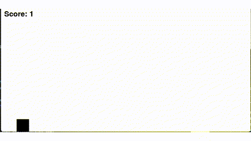

# DinosaurRL
A deep reinforcement learning agent that is trained to play an imitation of the Google Chrome Dinosaur Game.
## Demonstration
The agent learns to play the game perfectly after 800 episodes of training.

## Requirements
- pygame
- numppy
- torch
## Running
- Training the agent for 901 episodes (change the hyperparameters in rl_agent.py and the number of episodes and rewards in run_training.py)

`python run_training.py`
- Watching how a trained agent performs

`python run_trained_agent.py --policy_file trained_policy.pt --render_speed 120`
- Playing the game as a user

`python run_user_play.py`
## How it works
The Dinosaur Game, usually seen on Google Chrome when the internet is unavailable, is a side-scrolling game in which the user controls a dinosaur, making it jump or crouch to avoid obstacles (cacti and pterodactyls). This project involves a reinforcement learning (RL) agent that learns to play an imitation of the game. In this imitation, among other differences, the shape of the agent (dinosaur) and obstacles are mere rectangles (as shown in the demo above), and the agent has only 2 possible actions (jump or do nothing). The environment is defined in `env.py`.

The agent architecture is defined in `rl_agent.py`. As an RL agent, the agent begins taking random actions, measuring the rewards it gets as it passes through different states. As the agent's goal is to survive as long as it can, maximizing its score, it gets a reward, +0.1, for each step without colliding with an obstacle and a penalty, -100, for ending the game by colliding. The agent begins behaving exploratorily (where `episilon` (the probability of choosing a random action) is 1). Over time, as it learns which action in a given state will maximize its total reward for the episode/run, it behaves more exploitatively or greedily (where `episilon` decreases (meaning the probability of choosing an action that maximizes reward increases)). The policy of an agent is what it uses to play the game. It's a function that takes the state as an input and outputs an action. The optimal policy is one that chooses the action with the highest action value (the accumulation of all the expected future rewards for each action). This agent uses [Q-Learning](https://en.wikipedia.org/wiki/Q-learning) to learn the optimal policy. 

The state is represented as a 5-D vector, which is composed of the agent's y-position, its velocity, its distance to the nearest obstacle, said obstacle's y-position, and the obstacle type (whether it's a cactus or pterodactyl). Since this state space is continuous and too large to be represented tabularly, we have to use function approximation to determine the action values (accumulations of all the expected future rewards for each action). Function approximation involves generalizing from learned experience, allowing the agent to determine the optimal policy for states it has not precisely encountered yet. Here, function approximation is conducted using a [neural network](https://en.wikipedia.org/wiki/Neural_network_(machine_learning)), composed of an input layer (with 5 neurons corresponding to the 5 state dimensions), two hidden layers (the first with 128 neurons, the second with 64, both using `ReLU` activation) and an output layer (with 2 neurons for the estimated action values of the 2 possible actions (jump or do nothing)). As the agent learns, the weights in the networks are updated, gradually making better estimations of the optimal policy. This combination of deep neural networks is called `DQN` (Deep Q-Network). In addition, the `Adam` (Adaptive Moment Estimation) optimizer is used to help minimize the loss function while training the neural network.

The agent also uses experience replay to make learning faster. This involves storing past transitions (an experienced state, the action taken, the reward received, the following state, and whether or not the episode terminated) in a memory buffer and sampling from this buffer during training. Without experience replay, the agent learns sequentially (where the following update is based on the preceding transition), creating correlations between these sequential experiences. With random sampling, these correlations are broken, making learning more efficient.

